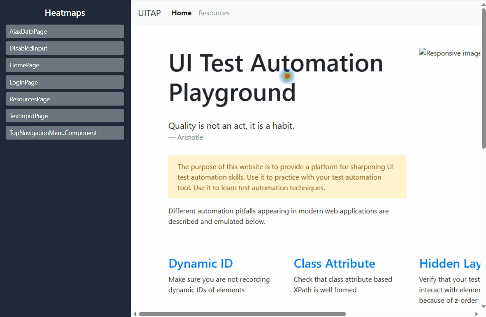

# Interaction Heatmap Report Documentation

The interaction heatmap report provies your UI test with another level of visibility and traceability for your test, showing exactly which element was interacted with, what the interaction was, and how many times it was interacted with. This can help identify any missing coverage points or excessive interactions that could be optimised.

Built directly into the `BaseLocator` class with the `@Interaction` decorator, it encourages proper test design and Page/Component Object Model consistency by automatically tracking your class and locator throughout your test runs and plotting the stats over a screenshot of said component or page.

In addition to tracking basic actions through BaseLocator, you can also decorate any other method with `@Interaction` and track your own custom logic if not using the BaseLocator methods.



## Usage

The basic report works out of the box and is enabled by default. You can toggle the reporter on/off by setting `RUN_HEATMAP_REPORT` in the .env file accordingly 

## Adding Additional Interactions

Right now, the interactions being tracked are defined in `src/utils/reporters/heatmap/heatmap.t.ts`:

```typescript
type InteractionType =
    | 'click'
    | 'doubleclick'
    | 'fill'
    | 'hover'
    | 'check'
    | 'uncheck'
    | 'dragdrop'
    | 'visibility_check'
```

You can add custom interactions to that type as needed. This is just a basic to get you started.

## Tracking the Interaction

Since the tracker is very much Locator-focused, the decorator used for this reporter requires that a locator be identifiable by the decorator. There are two options you have:

### Pass the locator directly to the decorated method
This requires that the Locator be passed as the first argument to the decorated method.
An example is something like the `BaseLocator` class that provides interaction wrappers for the other two base classes.
Only the interaction type needs to be provided to the decorator
```typescript
    /** 
     * here the locator being tracked is passed as the first argument 
     * and will be the one to be tracked by the heatmap reporter.
     */ 
    @Interaction('click')
    protected async safeClick(locator: Locator, options?: ClickOptions, timeout: number = 5000) {
        await expect(locator, 'Locator being clicked should be visible').toBeVisible({ timeout });
        await expect(locator, 'Locator being clicked should be enabled').toBeEnabled({ timeout });

        await locator.scrollIntoViewIfNeeded();
        // perform the click action
        await locator.click(options);
        await this.page.waitForLoadState('networkidle');
    }
```

### Pass the property/getter _name_ that returns the locator
If you're tracking custom actions or are not using the provided BaseLocator methods,
you can pass the name of the class property where the locator is stored or the name of the 
getter that returns said locator as a second argument to the decordator

```typescript
export class ExamplePOM extends BasePage {
    
    private readonly myLocator:Locator = this.page.locator('#locatorId')
    
    constructor(protected page: Page) {
        super(page, 'ExamplePOM');
    }

    /** page header locator */
    private get pageHeader():Locator {
        return this.page.getByRole('heading', { name: 'My Example Page Header' })
    }

    /** 
     * pass the name of the property or the getter to the decorator
     * as a string if the method is not getting the locator as an argument.
     */
    @Interaction('visibility_check', 'pageHeader')
    public async waitForPageLoad(): Promise<void> {
        await expect(this.pageHeader).toBeVisible();
    }

    @Interaction('click', 'myLocator')
    public async clickMyLocator(): Promise<void> {
        await this.myLocator.click();
    }
}
```


